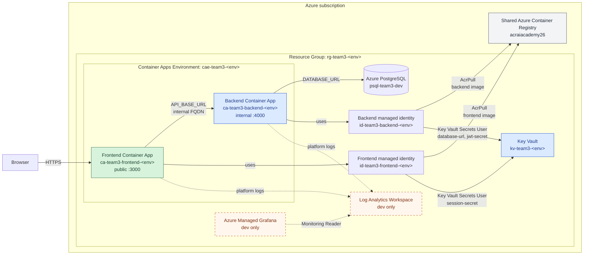

# Infrastructure

Terraform deploys the backend's Azure resources. The independent `dev` and
`prod` roots live under `environments/` and reuse modules from `modules/`.
Each root must use a separate remote-state key.

## Platform architecture

The diagram represents the dev environment. The monitoring resources shown
with dashed borders are deployed only in dev. The shared container registry and
secret values are managed outside this Terraform root.



## Dev architecture

The `dev` root manages:

- Resource group `rg-team3-dev` (imported because it already exists).
- Key Vault `kv-team3-dev`.
- User-assigned managed identity `id-team3-backend-dev`.
- Container App Environment `cae-team3-dev`.
- PostgreSQL Flexible Server `psql-team3-dev` and database `jobRoles`.
- Internal-only backend Container App `ca-team3-backend-dev` on port `4000`.
- `AcrPull` and `Key Vault Secrets User` role assignments for the managed
	identity.

The Container App pulls `team3-backend:<commit-sha>` from the shared ACR. It
reads `database-url` and `jwt-secret` from Key Vault without storing their
values in Terraform. The backend is not exposed through public ingress.
The PostgreSQL administrator password is supplied through a sensitive Terraform
write-only variable, so it is not committed or stored in Terraform state. Key
Vault secret values remain manually managed.

The dev container runs `prisma migrate deploy` and the idempotent Prisma seed
before starting the API, so a recreated empty database receives its schema and
development reference data. Seeding defaults to disabled in the shared module
and is not enabled by the production root.

## Production architecture

The `prod` root defines the equivalent isolated production resources using the
`prod` name suffix. Unlike dev, it creates `rg-team3-prod` and has no resource
group import block. Swagger defaults to disabled and backend ingress remains
internal-only.

Production is not deployed by the current workflow. Before its first apply,
create the production database, establish the production secret bootstrap
process, grant production-scoped deployment permissions, and add a protected
production deployment job.

The first production deployment is a two-stage bootstrap because
`kv-team3-prod` must exist before its secrets can be populated:

1. Apply only `module.key_vault` to create the production resource group and
	Key Vault.
2. Add `database-url` and `jwt-secret` through the Azure portal or an approved
	secret-management process. Do not put secret values in Terraform variables,
	state, committed files, or command history.
3. Run and review a complete production plan before applying the remaining
	resources.

The person or bootstrap identity adding secrets needs temporary permission to
write production Key Vault secrets. Remove that permission after bootstrap.

## Prerequisites

Before deploying either environment:

- Create the remote-state resource group, storage account, and blob container.
- Ensure `database-url` and `jwt-secret` exist in `kv-team3-dev` before
	deploying a dev backend revision. Use the production bootstrap sequence above
	for `kv-team3-prod`.
- Before the first dev PostgreSQL import, set
	`POSTGRESQL_ADMINISTRATOR_PASSWORD` to the existing server administrator
	password. Changing it rotates the server password, so update `database-url`
	at the same time and increment `postgresql_administrator_password_version`
	whenever this secret changes.
- Configure the GitHub Actions secrets listed below.

## GitHub configuration

The repository uses these existing Actions secrets:

| Secret | Purpose |
| --- | --- |
| `AZURE_CLIENT_ID` | Application/client ID of the deployment service principal |
| `AZURE_TENANT_ID` | Azure tenant ID |
| `AZURE_SUBSCRIPTION_ID` | Azure subscription ID |
| `ACR_NAME` | ACR resource name, without `.azurecr.io` |
| `POSTGRESQL_ADMINISTRATOR_PASSWORD` | Existing dev PostgreSQL administrator password used by Terraform |

Azure federated credentials trust pull requests and the `main` branch from this
repository, so the workflow uses short-lived OIDC tokens instead of a client
secret. The workflow contains the non-sensitive Terraform state resource names.
Grant the service principal only the roles it needs:

- `AcrPush` on the container registry.
- `Storage Blob Data Contributor` on the Terraform state storage account.
- `Contributor` on the subscription so Terraform can recreate `rg-team3-dev`
	after deletion.
- `Role Based Access Control Administrator` on the subscription, conditioned to
	allow `AcrPull`, `Key Vault Secrets User`, `Monitoring Reader`, and
	`Grafana Admin` assignments.

The dev root imports the existing resource group and PostgreSQL resources into
the separately stored remote state. Resource-group-scoped permissions are not
sufficient for recovery because their assignments are deleted with the resource
group.

## Terraform variables

| Variable | Purpose |
| --- | --- |
| `project_name` | Short name used in Azure resource names |
| `environment` | Deployment environment: `dev` or `prod` for the matching root |
| `location` | Azure region, currently `uksouth` for dev |
| `subscription_id` | Subscription containing the imported dev resource group (dev only) |
| `postgresql_administrator_password` | Sensitive dev PostgreSQL administrator password supplied by GitHub Actions |
| `postgresql_administrator_password_version` | Rotation counter for the write-only PostgreSQL password; increment when changing it |
| `acr_name` | Existing shared ACR name |
| `acr_resource_group_name` | Resource group containing the shared ACR |
| `backend_image_tag` | `dev-latest` in dev; an immutable commit SHA or release version in prod |
| `container_revision_suffix` | Optional dev revision suffix; CI sets this from the commit SHA |
| `enable_swagger_docs` | Exposes `/docs` and `/docs.json` when `true`; defaults to `false` |

GitHub Actions currently sets `enable_swagger_docs` to `true` for dev.

## CI/CD behaviour

Every push and pull request runs linting, tests, and a container build. Pull
requests also run Terraform format checks, validation, and a dev plan. A push
to `main` additionally:

1. Builds and pushes SHA-tagged and `dev-latest` images to ACR.
2. Creates and applies a Terraform plan for dev.
3. Deploys `dev-latest` in a new Container App revision identified by the commit SHA.

Feature branches do not push images or deploy infrastructure.

## Local Terraform checks

Authenticate with Azure, export the required `TF_VAR_*` values, then run:

```bash
terraform -chdir=infrastructure/environments/dev init \
	-backend-config="resource_group_name=rg-team3-tfstate" \
	-backend-config="storage_account_name=stteam3tfstate26" \
	-backend-config="container_name=tfstate" \
	-backend-config="key=team3-backend-dev.tfstate" \
	-backend-config="use_azuread_auth=true"
terraform fmt -check -recursive infrastructure
terraform -chdir=infrastructure/environments/dev validate
terraform -chdir=infrastructure/environments/dev plan
```

Terraform outputs include the resource names and IDs, the Container App
Environment domain, and the backend's internal FQDN.

Initialize production with the same backend storage but its own state key:
Production rejects the mutable `latest` and `dev-latest` tags, so provide an
immutable commit SHA or release version.

```bash
export TF_VAR_project_name=team3
export TF_VAR_environment=prod
export TF_VAR_location=uksouth
export TF_VAR_acr_name=acraiacademy26
export TF_VAR_acr_resource_group_name=rg-ai-academy-26
export TF_VAR_backend_image_tag=<existing-tested-image-sha>
export TF_VAR_enable_swagger_docs=false

terraform -chdir=infrastructure/environments/prod init \
	-backend-config="resource_group_name=rg-team3-tfstate" \
	-backend-config="storage_account_name=stteam3tfstate26" \
	-backend-config="container_name=tfstate" \
	-backend-config="key=team3-backend-prod.tfstate" \
	-backend-config="use_azuread_auth=true"
terraform -chdir=infrastructure/environments/prod validate
terraform -chdir=infrastructure/environments/prod plan
```

For the one-time Key Vault bootstrap, review a targeted plan before applying
it:

```bash
terraform -chdir=infrastructure/environments/prod plan \
	-target=module.key_vault \
	-out=key-vault-bootstrap.tfplan
terraform -chdir=infrastructure/environments/prod apply key-vault-bootstrap.tfplan
```

Targeted apply is only for this bootstrap dependency. After the secrets exist,
return to normal full plans and applies.