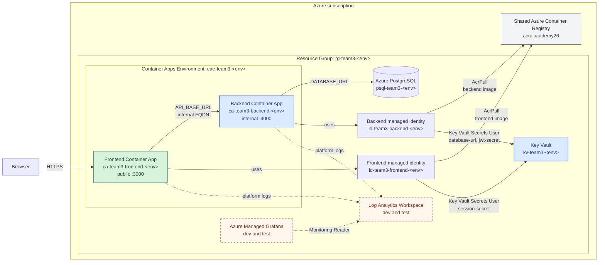

# Infrastructure

Terraform deploys the backend's Azure resources. The independent `dev`, `test`,
and `prod` roots live under `environments/` and reuse modules from `modules/`.
Each root uses a separate remote-state key in the shared `tfstate` container:

- `dev` uses `team3-backend-dev.tfstate`.
- `test` uses `team3-backend-test.tfstate`.
- `prod` uses `team3-backend-prod.tfstate`.

The backend state owns the shared platform resources declared by each root,
including the resource group, Key Vault, Container Apps Environment, backend
identity, and backend Container App. Dev and test also own the database and
monitoring. The frontend has a separate state key because it is deployed from
another repository and owns only its identity, role assignments, and Container
App. This prevents either workflow from locking or planning changes against
resources owned by the other repository.

## Platform architecture

The diagram represents the complete dev and test environments. Production is
currently a partial root, described separately below. The shared container
registry is managed outside this Terraform root, while the backend dev state
owns the team image-cleanup task attached to it.



## Dev architecture

The `dev` root manages:

- Resource group `rg-team3-dev`.
- Key Vault `kv-team3-dev`.
- User-assigned managed identity `id-team3-backend-dev`.
- Container App Environment `cae-team3-dev`.
- PostgreSQL Flexible Server `psql-team3-dev` and database `jobRoles`.
- Internal-only backend Container App `ca-team3-backend-dev` on port `4000`.
- `AcrPull` and `Key Vault Secrets User` role assignments for the managed
	identity.

The Container App pulls `team3-backend:dev-<commit-sha>` from the shared ACR. It
reads Terraform-managed `database-url` and `jwt-secret` values from Key Vault.
The backend is not exposed through public ingress. The backend root also owns
the frontend's `session-secret`, keeping application secret ownership in one
state.

The PostgreSQL administrator password is supplied through a sensitive Terraform
write-only variable. Key Vault values use write-only arguments, so neither that
password nor the constructed database URL is stored in state. Generated JWT and
session credentials are stored as sensitive values in the encrypted remote
state so Terraform can recreate them after resource loss.

The dev container runs `prisma migrate deploy` and the idempotent Prisma seed
before starting the API, so a recreated empty database receives its schema and
development reference data.

### Registry lifecycle

The dev state owns the `purge-team3-images` ACR Task for both application image
repositories. It runs daily at 01:00 UTC independently of application
deployments and applies these policies:

- Dev SHA tags older than 48 hours are removed, while the newest immutable tag
	remains available alongside `dev-latest`.
- Test SHA tags older than 24 hours are removed, while the current immutable tag
	remains available; frontend also keeps the `test-latest` alias.
- Production tags are not matched and must use a separate release-retention and
	locking policy before production deployment is enabled.

The task uses Microsoft's `acr purge` command. Validate filter changes with
`--dry-run` before applying them because deleted registry content is
unrecoverable. Image publishing disables Buildx provenance because this
single-platform registry does not consume attestations and representing each
build as one directly tagged manifest avoids accumulating untagged OCI child
manifests. Existing untagged manifests require graph-aware cleanup: manifests
referenced by a tagged OCI index must not be deleted.

## Test architecture

The `test` root creates the same isolated platform shape as dev in
`rg-team3-test`, including PostgreSQL, Log Analytics, Grafana, generated
application secrets, and the backend Container App. Its PostgreSQL administrator
password is also generated by Terraform. Test data seeding is enabled.

The test provider recovers the same Key Vault name if Azure still holds a
soft-deleted, purge-protected `kv-team3-test`. It also permits resource-group
deletion to remove Azure resources that finished creating after a cancelled
Terraform run. These recovery settings apply only to test.

## Production status

The `prod` root currently defines the resource group, Key Vault, backend
identity, Container Apps Environment, RBAC, and backend Container App. It does
not define PostgreSQL, application secrets, monitoring, or a CI/CD deployment
job. The Container App expects `database-url` and `jwt-secret` to exist, so this
root is not yet an end-to-end production deployment.

Before deploying production, add the missing database and secret ownership,
grant production-scoped permissions, and introduce a protected workflow with
manual approval. Production requires an immutable image tag and disables
Swagger by default.

## Prerequisites

Before deploying dev or test:

- Create the remote-state resource group, storage account, and blob container.
- Set `POSTGRESQL_ADMINISTRATOR_PASSWORD` for dev. Test generates its own
	PostgreSQL administrator password.
- Configure the GitHub Actions secrets listed below.

## GitHub configuration

The repository uses these existing Actions secrets:

| Secret | Purpose |
| --- | --- |
| `AZURE_CLIENT_ID` | Application/client ID of the deployment service principal |
| `AZURE_TENANT_ID` | Azure tenant ID |
| `AZURE_SUBSCRIPTION_ID` | Azure subscription ID |
| `DATABASE_URL` | Optional test database URL for CI; tests fall back to local SQLite when absent |
| `POSTGRESQL_ADMINISTRATOR_PASSWORD` | Dev PostgreSQL administrator password used by Terraform |
| `FRONTEND_REPOSITORY_DISPATCH_TOKEN` | Fine-grained token with Contents write permission on `team3-frontend`, used to start frontend deployment after backend succeeds |

Azure federated credentials trust pull requests and the `main` branch from this
repository, so the workflow uses short-lived OIDC tokens instead of a client
secret. The workflow contains the non-sensitive Terraform state resource names.
Grant the service principal only the roles it needs:

- `AcrPush` on the container registry.
- `Storage Blob Data Contributor` on the Terraform state storage account.
- `Contributor` on the subscription so Terraform can recreate `rg-team3-dev`
	after deletion.
- `Role Based Access Control Administrator` on the subscription, conditioned to
	allow `AcrPull`, `Key Vault Secrets User`, `Key Vault Secrets Officer`,
	`Monitoring Reader`, and `Grafana Admin` assignments.

The configuration contains no permanent import blocks, so missing resources
are recreated. Resource-group-scoped permissions alone are not sufficient for
recovery because those assignments are deleted with the resource group.

## Terraform variables

| Variable | Purpose |
| --- | --- |
| `project_name` | Short name used in Azure resource names |
| `environment` | Deployment environment: `dev`, `test`, or `prod` for the matching root |
| `location` | Azure region, currently `uksouth` for dev |
| `deployment_principal_object_id` | Object ID granted vault-scoped Secrets Officer so Terraform can write application secrets |
| `postgresql_administrator_password` | Sensitive dev PostgreSQL administrator password supplied by GitHub Actions; test generates its password |
| `postgresql_administrator_password_version` | Rotation counter for the write-only PostgreSQL password; increment when changing it |
| `application_secret_version` | Rotation counter for generated JWT and session credentials |
| `acr_name` | Existing shared ACR name |
| `acr_resource_group_name` | Resource group containing the shared ACR |
| `backend_image_tag` | `dev-<commit-sha>` in dev, `test-<commit-sha>` in test, or an immutable SHA/release tag in prod |
| `container_revision_suffix` | Optional revision suffix; CI uses the workflow run ID |
| `enable_swagger_docs` | Exposes `/docs` and `/docs.json` when `true`; defaults to `false` |

GitHub Actions currently sets `enable_swagger_docs` to `true` for dev.

## CI/CD behaviour

Every pull request runs linting, tests, a container build, Terraform format
checks, validation, and a dev plan. Feature-branch pushes do not run CI until a
pull request is opened. A push to `main`:

1. Builds and pushes `dev-<commit-sha>` and `dev-latest` images to ACR.
2. Creates the Key Vault and deployment-principal Secrets Officer assignment if
	they are missing.
3. Creates and applies a complete Terraform plan for dev using the immutable
	commit SHA image.
4. Dispatches the frontend workflow only after the backend apply succeeds.

Feature branches do not push images or deploy infrastructure automatically.

### Run a test deployment

Run the backend [CI workflow](https://github.com/kainos-birmingham-academy-2026/team3-backend/actions/workflows/ci.yml)
manually from the `main` branch and enable `deploy_test`. Running the workflow
from `main` ensures the infrastructure and workflow definitions are trusted and
current.

Choose the application refs according to what you need to verify:

| Goal | `backend_ref` | `frontend_ref` |
| --- | --- | --- |
| Validate the integrated current code | `main` | `main` |
| Test a backend feature with the current frontend | Backend feature branch, tag, or SHA | `main` |
| Test a frontend feature with the current backend | `main` | Frontend feature branch, tag, or SHA |
| Test coordinated changes | Matching backend ref | Matching frontend ref |

The inputs have these effects:

- **backend_ref** selects the backend branch, tag, or commit built and deployed
	as `test-<commit-sha>`.
- **frontend_ref** selects the frontend branch, tag, or commit passed to the
	frontend deployment.

Both references are resolved to exact commit SHAs in the first workflow job. An
unknown branch, tag, or SHA fails the run before tests, image pushes, or
Terraform changes begin.

The test deployment uses `team3-backend-test.tfstate` and creates resources in
`rg-team3-test`. The workflow and Terraform configuration always come from
`main`; only the application images come from the selected refs. The deployment
does not read or update dev state. A dedicated concurrency group prevents a dev
deployment from cancelling an in-progress manual test deployment.

## Local Terraform checks

Authenticate with Azure, export the required `TF_VAR_*` values, then run:

```bash
terraform -chdir=infrastructure/environments/dev init \
	-backend-config="resource_group_name=rg-team3-tfstate" \
	-backend-config="storage_account_name=stteam3tfstate26" \
	-backend-config="container_name=tfstate" \
	-backend-config="key=team3-backend-dev.tfstate" \
	-backend-config="use_azuread_auth=true"
terraform fmt -check -recursive infrastructure
terraform -chdir=infrastructure/environments/dev validate
terraform -chdir=infrastructure/environments/dev plan
```

Terraform outputs include resource names and IDs, the Container App Environment
domain, and the backend's internal FQDN.

Production rejects `latest` and `dev-latest`, so provide an immutable commit SHA
or release version when reviewing its current partial root:

```bash
export TF_VAR_project_name=team3
export TF_VAR_environment=prod
export TF_VAR_location=uksouth
export TF_VAR_acr_name=acraiacademy26
export TF_VAR_acr_resource_group_name=rg-ai-academy-26
export TF_VAR_backend_image_tag=<existing-tested-image-sha>
export TF_VAR_enable_swagger_docs=false

terraform -chdir=infrastructure/environments/prod init \
	-backend-config="resource_group_name=rg-team3-tfstate" \
	-backend-config="storage_account_name=stteam3tfstate26" \
	-backend-config="container_name=tfstate" \
	-backend-config="key=team3-backend-prod.tfstate" \
	-backend-config="use_azuread_auth=true"
terraform -chdir=infrastructure/environments/prod validate
terraform -chdir=infrastructure/environments/prod plan
```