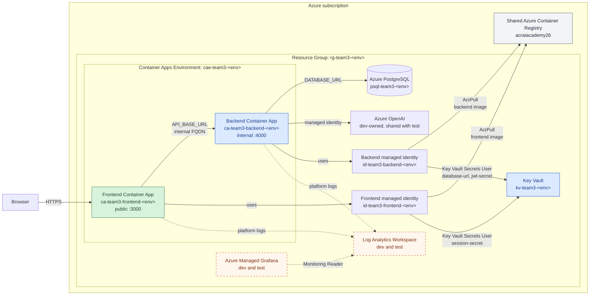

# Infrastructure

Terraform deploys the backend's Azure resources. The independent `dev`, `test`,
and `prod` roots live under `environments/` and reuse modules from `modules/`.
Each root uses a separate remote-state key in the shared `tfstate` container:

- `dev` uses `team3-backend-dev.tfstate`.
- `test` uses `team3-backend-test.tfstate`.
- `prod` uses `team3-backend-prod.tfstate`.

The backend state owns the shared platform resources declared by each root,
including the resource group, Key Vault, Container Apps Environment, backend
identity, and backend Container App. Dev and test also own the database and
monitoring, plus the Service Bus and email notification platform. The frontend
has a separate state key because it is deployed from another repository and
owns only its identity, role assignments, and Container App. This prevents
either workflow from locking or planning changes against resources owned by the
other repository.

## Network foundation

The backend dev, test and prod roots each own a VNet through `modules/network`.
The test root selects a separate network for each numbered slot. No peering,
public IPs or gateways are created. Dev and every test slot use private
PostgreSQL connectivity.

| Environment | VNet address space | Container Apps subnet |
| --- | --- | --- |
| dev | `10.60.0.0/16` | `10.60.0.0/23` |
| test1 | `10.61.0.0/16` | `10.61.0.0/23` |
| test2 | `10.62.0.0/16` | `10.62.0.0/23` |
| test3 | `10.63.0.0/16` | `10.63.0.0/23` |
| uat (reserved only) | `10.64.0.0/16` | `10.64.0.0/23` |
| prod | `10.65.0.0/16` | `10.65.0.0/23` |

Networks are named `vnet-team3-<environment>` and belong to the matching backend
resource group and state. Deleting a test slot's resource group also removes its
network. UAT has a reserved address range but no root or resources yet. Check
these ranges against existing Azure, corporate and VPN networks before applying;
the table only guarantees separation within this project's address map.

Each `snet-container-apps` subnet is delegated to `Microsoft.App/environments`
for a workload profiles Container Apps Environment. The /23 allocation leaves
capacity for scaling, and the next `/24` range is reserved for private endpoints.
The rest of each VNet is unallocated.

Azure cannot convert an existing Container Apps Environment to VNet integration
in place. Before the first deployment of this design, tear down and recreate
each disposable dev and test resource group, including frontend-owned resources
in their separate Terraform states. Deploy backend infrastructure first, then
the frontend through the backend workflow dispatch. Production is out of scope.

Offline module checks use a mocked Azure provider and do not provision resources:

```bash
terraform -chdir=infrastructure/modules/network init -backend=false
terraform -chdir=infrastructure/modules/network test
terraform fmt -check -recursive infrastructure
```

Provider locks are owned by the environment roots; the standalone module init
may generate a local lock file that should not be committed.

### Private environment networking

#### Private database smoke test

Terraform provisions the manual Container Apps Job
`caj-team3-private-smoke-<environment>` in the VNet-integrated environment.
The test deployment workflow starts it after applying Terraform and waits for
that specific execution to succeed. A failure or timeout fails the deployment
job; it does not roll back the applied infrastructure.

The job reuses the deployed backend image but overrides its startup command,
so it never runs migrations, seeding or E2E database resets. It requires all
PostgreSQL DNS answers to match the private endpoint address, then executes
only `SELECT 1`. It has a 60-second probe deadline, a 120-second replica limit,
and no automatic retries. CI waits up to ten minutes (with a 12-minute step
limit) to allow for image pulls and scheduling.

The existing backend identity pulls the image and retrieves `database-url`
from Key Vault. This reuses the application's database credentials; it is not
a dedicated least-privilege database identity. Logs report only the stage and
outcome, never the URL or database exception. Inspect execution logs in Azure
Container Apps if the CI step reports failure. The job checks private DNS and
database access only, not backend HTTP routes or frontend E2E behaviour.

Offline checks:

```bash
npx vitest run tests/private-smoke-test.test.mjs
terraform -chdir=infrastructure/environments/test test -filter=tests/private-postgresql.tftest.hcl
```

#### Mandatory configuration

Every dev and test Container Apps environment attaches to `snet-container-apps`
with an explicit Consumption workload profile. Each also provisions private
PostgreSQL connectivity as described below. No Dedicated workload capacity, VPN,
NAT Gateway or Azure Firewall is provisioned.

The environment retains external load balancing. The frontend stays publicly
reachable and the backend retains internal-only app ingress. This is compatible
with the intended Front Door Standard public-origin design, but origin
restrictions are a later phase. Do not enable external backend ingress to allow
laptop tests: that would expose the backend publicly.

The frontend root discovers the environment by its unchanged name. Its current
Terraform does not need a change for a fresh slot. Existing deployments must be
coordinated because the frontend owns its app in a separate state.

To deploy a test environment after its resource group has been recreated:

1. Review the code and run the module checks below. Confirm the live slot state
	before deployment; a previously absent slot may have been recreated.
2. Run backend CI with `deploy_test=true` and select `test_environment`.
3. Use the intended `backend_ref` and `frontend_ref`. The frontend workflow must
	contain the deployment controls on its default branch before a repository
	dispatch can use them.
4. CI creates the integrated backend environment, validates private database
	connectivity, and dispatches the frontend deployment exactly once.
5. Inspect the environment's `vnetConfiguration.infrastructureSubnetId` and
	`workloadProfiles` in Azure, then verify frontend health, frontend-to-backend
	requests and denied public backend access. Use a runner with private connectivity
	for E2E tests that access the environment database directly.

CI automatically applies its saved plan. There is no manual approval pause and
the workflow assumes the old resource group has already been removed. Existing
secret-RBAC bootstrap behaviour is unchanged and also applies automatically.

A separately reviewed plan is advisory: CI generates a fresh plan, rather than
applying the reviewed artifact, and intervening changes can alter the result.
If approval of the exact applied plan is required, do not dispatch this workflow
until a plan-only/approval mechanism has been added.

Do not deploy an older workflow ref that lacks mandatory networking. Local
Terraform plans need the matching `TF_VAR_environment` alongside the usual root
inputs and backend setup.

```bash
terraform -chdir=infrastructure/modules/container-app-environment init -backend=false
terraform -chdir=infrastructure/modules/container-app-environment test
terraform -chdir=infrastructure/environments/test init -backend=false -lockfile=readonly
terraform -chdir=infrastructure/environments/test test -filter=tests/private-postgresql.tftest.hcl
```

Private mode establishes network attachment and private PostgreSQL access, not
private access to all dependencies or Front Door-only protection.

#### Private PostgreSQL access

The dev and test roots create:

- A non-delegated `snet-private-endpoints` subnet at `10.63.2.0/24`, separate
	from the Container Apps infrastructure subnet.
- A PostgreSQL private endpoint targeting the existing server, with an
	automatically approved `postgresqlServer` connection.
- The `privatelink.postgres.database.azure.com` private DNS zone, a link to the
	environment VNet and an endpoint DNS zone group that manages the private address.

This design disables public network access on PostgreSQL and creates no public-IP
firewall rule. The VNet-integrated Container App can report many potential
outbound IP addresses; none grants database access.

The server and its database are not intentionally replaced. In the separate
pre-deployment plan review described above, stop before dispatching CI if the
plan proposes deleting or replacing either. Existing servers
must advertise Private Link support; servers created in PostgreSQL's delegated
VNet integration mode cannot use this approach. Disabling public access may
briefly interrupt database connectivity while the endpoint and DNS become
available. This is not a zero-downtime migration.

The database URL keeps the existing server FQDN and `sslmode=require`. No password
rotation or Key Vault secret version increment is needed just for this networking
change. Backend deployment depends on the endpoint and DNS link; Prisma
migrations and seeding run inside that container, not on the GitHub runner.
Azure resource completion does not guarantee immediate DNS propagation. Check
revision logs and restart or deploy a fresh revision if an initial DNS lookup
prevents startup.

After applying, verify that PostgreSQL public access is `Disabled`, the private
endpoint connection is `Approved`, and the server FQDN resolves to an address in
`10.63.2.0/24` from the Container Apps environment. Confirm a database-backed
frontend request succeeds and public database connectivity is denied. Mock tests
verify the Terraform plan, not live DNS or database connectivity.

Ordinary GitHub-hosted runners and laptops cannot connect directly to this
database. Frontend E2E database-reset helpers need a private execution path when
targeting a private environment. A Container Apps Job in the same environment is the intended
private test runner; it is not provisioned here. The frontend remains public,
and Key Vault, Service Bus and the shared OpenAI service keep their existing
networking. Private Endpoint traffic and Private DNS introduce Azure charges.

Deploy a new CI run from a ref containing these changes; rerunning a failed job
at an older commit will not use the fix. Retain partially deployed environment
state for recovery.

## Platform architecture

The diagram represents the complete dev and test environments. Production is
currently a partial root, described separately below. The shared container
registry is managed outside this Terraform root.



## Dev architecture

The `dev` root manages:

- Resource group `rg-team3-dev`.
- Key Vault `kv-team3-dev`.
- User-assigned managed identity `id-team3-backend-dev`.
- Container App Environment `cae-team3-dev`.
- PostgreSQL Flexible Server `psql-team3-dev` and database `jobRoles`.
- Internal-only backend Container App `ca-team3-backend-dev` on port `4000`.
- `AcrPull` and `Key Vault Secrets User` role assignments for the managed
	identity.

The Container App pulls `team3-backend:<commit-sha>` from the shared ACR. It
reads Terraform-managed `database-url`, `jwt-secret`, and
`service-bus-connection-string` values from Key Vault.
The backend is not exposed through public ingress. The backend root also owns
the frontend's `session-secret`, keeping application secret ownership in one
state.

The PostgreSQL administrator password is supplied through a sensitive Terraform
write-only variable. Key Vault values use write-only arguments, so neither that
password nor the constructed database URL is stored in state. Generated JWT and
session credentials are stored as sensitive values in the encrypted remote
state so Terraform can recreate them after resource loss.

After recovering Key Vault alongside a recreated PostgreSQL server, the
`database-url` secret may still contain the old password. Increment
`postgresql_administrator_password_version` in the dev root and deploy through
CI to rewrite both the server password and the secret from the same
`POSTGRESQL_ADMINISTRATOR_PASSWORD` GitHub secret. Terraform cannot compare
write-only values, so an unchanged version can leave recovered credentials
stale. Confirm that migrations complete and the frontend job list returns HTTP
200 after deployment; a successful infrastructure apply alone is not a health
check.

The dev container runs `prisma migrate deploy` and the idempotent Prisma seed
before starting the API, so a recreated empty database receives its schema and
development reference data.

Dev owns the Azure OpenAI account `aoai-team3-chatbot-dev` and its
`team3-chatbot-gpt5-nano` deployment. Test consumes this shared deployment.
Terraform grants each backend identity `Cognitive Services OpenAI User` and
configures the containers to authenticate with their managed identities.

Dev and test each provision a Standard Service Bus namespace with the
`notifications` topic and `email-processor` subscription. Separate Send-only
and Listen-only policies provide credentials for the backend and notification
Function. Terraform stores those credentials and the Azure Communication
Services credential in Key Vault and configures both workloads to read them.

The notification platform also includes a Flex Consumption Node.js Function
App, storage, Application Insights, Azure Communication Services, Email
Communication Services, an Azure-managed email domain, and the domain
association. CI builds and deploys `functions/notifications` after each
successful dev or test Terraform apply.

### Dev service automation

Only the dev root provisions Automation Account `aa-team3-dev`, with a
system-assigned managed identity and two published PowerShell 5.1 runbooks:

- `Start-Team3-Services`: starts the backend, then the frontend.
- `Stop-Team3-Services`: stops the frontend, then the backend.

Terraform imports `Az.Accounts` 5.3.0 before `Az.App` 2.0.0. The identity has a
built-in `Container Apps Contributor` role assignment scoped to `rg-team3-dev`.
This permits Container App management beyond start/stop, but does not grant
access to test or prod. The deployment principal must be allowed to assign
this role in that scope; creating custom role definitions is not required.

Deploy through the existing dev Terraform workflow. Subsequent dev applies
recreate deleted automation resources while the remote state is retained.
If resources with these names already exist outside Terraform, import them
into the dev state before applying instead of deleting them.

Both dev Container Apps must exist before running either runbook; the frontend
is deployed by its separate repository. After deployment and RBAC propagation,
run either published runbook from `aa-team3-dev` in the Azure portal and inspect
its job output. No schedules or automatic job execution are configured. These
runbooks do not start or stop PostgreSQL or other platform services. Test and
prod do not provision this automation.

## Test architecture

The `test` root creates the same isolated platform shape as dev in
`rg-team3-test`, including PostgreSQL, Log Analytics, Grafana, generated
application secrets, and the backend Container App. Its PostgreSQL administrator
password is also generated by Terraform. Test data seeding is enabled.

The test provider recovers the same Key Vault name if Azure still holds a
soft-deleted, purge-protected `kv-team3-test`. It also permits resource-group
deletion to remove Azure resources that finished creating after a cancelled
Terraform run. These recovery settings apply only to test.

## Production status

The `prod` root currently defines the resource group, Key Vault, backend
identity, Container Apps Environment, RBAC, and backend Container App. It does
not define PostgreSQL, application secrets, monitoring, or a CI/CD deployment
job. The Container App expects `database-url`, `jwt-secret`, and
`service-bus-connection-string` to exist, so this root is not yet an end-to-end
production deployment.

Before deploying production, add the missing database and secret ownership,
grant production-scoped permissions, and introduce a protected workflow with
manual approval. Production requires an immutable image tag and disables
Swagger by default.

## Prerequisites

Before deploying dev or test:

- Create the remote-state resource group, storage account, and blob container.
- Set `POSTGRESQL_ADMINISTRATOR_PASSWORD` for dev. Test generates its own
	PostgreSQL administrator password.
- Configure the GitHub Actions secrets listed below.

### Adopt the existing Azure OpenAI resources

The Azure OpenAI account and model deployment existed before Terraform began
managing them. Before the first apply containing these resource declarations,
import both resources into the dev state:

```bash
terraform -chdir=infrastructure/environments/dev import \
	azurerm_cognitive_account.openai \
	/subscriptions/<subscription-id>/resourceGroups/rg-team3-dev/providers/Microsoft.CognitiveServices/accounts/aoai-team3-chatbot-dev
terraform -chdir=infrastructure/environments/dev import \
	azurerm_cognitive_deployment.openai \
	/subscriptions/<subscription-id>/resourceGroups/rg-team3-dev/providers/Microsoft.CognitiveServices/accounts/aoai-team3-chatbot-dev/deployments/team3-chatbot-gpt5-nano
```

Dev CI now performs this adoption automatically for these exact account and
deployment names when they exist in Azure but are missing from dev state.

### Recover OpenAI after deleting dev

Keep the remote state and shared ACR intact. On the next main push deployment,
CI recreates the resource group during the Key Vault permissions bootstrap,
then runs `.github/scripts/recover-openai.mjs` before the full Terraform plan.
The helper restores the matching soft-deleted account with `restore: true`,
waits up to ten minutes for provisioning, and imports the account and any
recovered `team3-chatbot-gpt5-nano` deployment only if missing from state.
Already tracked resources are left to the normal Terraform refresh. If neither
an active nor a soft-deleted account exists, Terraform creates it normally.

The recovery helper never purges resources or removes state. Azure/API errors,
unexpected responses, restore timeouts and import failures stop deployment.
Rerun the deployment after addressing the error; a partial successful import
does not need repeating. Recovery requires Azure to still retain the deleted
account; this does not restore other dev data or refresh stale application
credentials. Reapply affected test slots afterwards to restore their OpenAI
role assignments.

The CI identity needs subscription-level access to list deleted Cognitive
Services accounts, permission to read/write the dev account and read its model
deployments, plus existing remote-state access. The subscription Contributor
role documented below covers these Azure resource operations; permissions
scoped only to the deleted resource group do not. Do not add purge permissions
solely for this helper.

Run the isolated tests without Azure credentials:

```bash
node --test .github/scripts/recover-openai.test.mjs
```

## GitHub configuration

The repository uses these existing Actions secrets:

| Secret | Purpose |
| --- | --- |
| `AZURE_CLIENT_ID` | Application/client ID of the deployment service principal |
| `AZURE_TENANT_ID` | Azure tenant ID |
| `AZURE_SUBSCRIPTION_ID` | Azure subscription ID |
| `DATABASE_URL` | Optional test database URL for CI; tests fall back to local SQLite when absent |
| `POSTGRESQL_ADMINISTRATOR_PASSWORD` | Dev PostgreSQL administrator password used by Terraform |
| `FRONTEND_REPOSITORY_DISPATCH_TOKEN` | Fine-grained token with Contents write permission on `team3-frontend`, used to start frontend deployment after backend succeeds |

Azure federated credentials trust pull requests and the `main` branch from this
repository, so the workflow uses short-lived OIDC tokens instead of a client
secret. The workflow contains the non-sensitive Terraform state resource names.
Grant the service principal only the roles it needs:

- `AcrPush` on the container registry.
- `Storage Blob Data Contributor` on the Terraform state storage account.
- `Contributor` on the subscription so Terraform can recreate `rg-team3-dev`
	after deletion.
- `Role Based Access Control Administrator` on the subscription, conditioned to
	allow `AcrPull`, `Key Vault Secrets User`, `Key Vault Secrets Officer`,
	`Monitoring Reader`, and `Grafana Admin` assignments.

The configuration contains no permanent import blocks, so missing resources
are recreated. Resource-group-scoped permissions alone are not sufficient for
recovery because those assignments are deleted with the resource group.

## Terraform variables

| Variable | Purpose |
| --- | --- |
| `project_name` | Short name used in Azure resource names |
| `environment` | Deployment environment: `dev`, `test`, or `prod` for the matching root |
| `location` | Azure region, currently `uksouth` for dev |
| `deployment_principal_object_id` | Object ID granted vault-scoped Secrets Officer so Terraform can write application secrets |
| `postgresql_administrator_password` | Sensitive dev PostgreSQL administrator password supplied by GitHub Actions; test generates its password |
| `postgresql_administrator_password_version` | Rotation counter for the write-only PostgreSQL password; increment when changing it |
| `application_secret_version` | Rotation counter for generated JWT and session credentials |
| `notification_credentials_version` | Rotation counter for write-only Service Bus and ACS credentials; increment when either credential changes |
| `acr_name` | Existing shared ACR name |
| `acr_resource_group_name` | Resource group containing the shared ACR |
| `backend_image_tag` | Immutable commit SHA in dev, `test-<commit-sha>` in test, or an immutable SHA/release tag in prod |
| `container_revision_suffix` | Optional revision suffix; CI uses the workflow run ID |
| `enable_swagger_docs` | Exposes `/docs` and `/docs.json` when `true`; defaults to `false` |

GitHub Actions currently sets `enable_swagger_docs` to `true` for dev.

## CI/CD behaviour

Every pull request runs linting, tests, a container build, Terraform format
checks, validation, and a dev plan. Feature-branch pushes do not run CI until a
pull request is opened. A push to `main`:

1. Builds and pushes SHA-tagged and `dev-latest` images to ACR.
2. Creates the Key Vault and deployment-principal Secrets Officer assignment if
	they are missing.
3. Creates and applies a complete Terraform plan for dev using the immutable
	commit SHA image.
4. Dispatches the frontend workflow only after the backend apply succeeds.

Feature branches do not push images or deploy infrastructure automatically.

### Run a test deployment

Run the backend [CI workflow](https://github.com/kainos-birmingham-academy-2026/team3-backend/actions/workflows/ci.yml)
manually from the `main` branch and enable `deploy_test`. Running the workflow
from `main` ensures the infrastructure and workflow definitions are trusted and
current.

Choose the application refs according to what you need to verify:

| Goal | `backend_ref` | `frontend_ref` |
| --- | --- | --- |
| Validate the integrated current code | `main` | `main` |
| Test a backend feature with the current frontend | Backend feature branch, tag, or SHA | `main` |
| Test a frontend feature with the current backend | `main` | Frontend feature branch, tag, or SHA |
| Test coordinated changes | Matching backend ref | Matching frontend ref |

The inputs have these effects:

- **test_environment** selects `test1` (default), `test2`, or `test3`.
	Selecting an occupied slot updates it; there is no automatic free-slot
	allocation. Agree slot ownership with the team before deploying.
- **backend_ref** selects the backend branch, tag, or commit built and deployed
	as `test-<commit-sha>`.
- **frontend_ref** selects the frontend branch, tag, or commit passed to the
	frontend deployment.

Both references are resolved to exact commit SHAs in the first workflow job. An
unknown branch, tag, or SHA fails the run before tests, image pushes, or
Terraform changes begin.

Each slot reuses `infrastructure/environments/test` with `TF_VAR_environment`
set to the selected name. It uses `team3-backend-<slot>.tfstate` and creates
resources in `rg-team3-<slot>`. The frontend receives the same slot and resolved
commit in the dispatch payload and uses `team3-frontend-<slot>.tfstate`.
Never reuse one slot's state key with another slot's environment value.

Run the workflow from `main` for trusted workflow and Terraform configuration;
the application refs can select other branches. Dev state is unchanged.
Concurrency groups are slot-specific, allowing different slots to deploy in
parallel. Existing slots retain warm frontend dispatch; missing prerequisites
keep backend-first ordering. Image tags remain `test-<commit-sha>` and can be
reused by multiple slots without sharing their databases or application secrets.

Merge the frontend slot support before the backend workflow changes. Dispatches
without a valid numbered slot now fail validation. Avoid Test deployments
between these merges. The existing `rg-team3-test` and its state are not renamed,
migrated or deleted by this change; retire them separately when no longer needed.
Local Terraform defaults to `test1`. Reinitialise with `-reconfigure` and the
matching `team3-backend-<slot>.tfstate` key before planning if the directory was
previously initialised against legacy `test`. Do not migrate legacy state into
a numbered slot.
All slots still depend on the shared ACR, remote state storage and the OpenAI
account/model in Dev. Additional slots consume Azure quota and incur costs.

### Scheduled lifecycle

The **Test environment lifecycle** workflow accepts `start` or `stop` and a slot
dropdown for manual runs. Weekday cron triggers are 01:15 UK time for `test1`
startup and 15:30 UK time for deletion of `test1`, `test2` and `test3`.
These are temporary empirical offsets based on the September 2026 run history:
startup was 5h 04m to 6h 48m late, and deletion had a median offset of 2h 35m.
If those offsets persist, startup should trigger around 06:19-08:03, with
deployment time additional, and deletion should typically trigger around 18:05.
Reassess after subsequent runs; if the offsets disappear, actions will run at
the earlier cron times, including deletion at 15:30.
Each schedule uses `timezone: Europe/London` to handle GMT/BST automatically.
The triggering cron selects start or stop; there is no execution-time gate.
GitHub schedules can be delayed, and delayed runs still perform their scheduled
action, including deletion. These are requested start times, not timing guarantees.
Only `test1` starts automatically. Other slots are created on demand.

Deletion uses the selected slot's deployment lock and conservatively waits for
active or queued frontend repository-dispatch runs, including other slots.
GitHub concurrency groups are repository-scoped; this check is not a distributed
lock and does not cover every possible manually queued or rerun frontend job.
Do not trigger independent frontend deployments while teardown is running.
The dispatch token needs frontend Actions read permission for this check, in
addition to Contents write permission for repository dispatch.

Deleting a slot removes its database contents and queued notifications. The
next deployment provisions/seeds the database; it does not restore test data.
Keep the remote state and Dev OpenAI resources. Purge-protected Key Vaults are
soft-deleted and recovered by the Test provider. No slot is deleted simply by
merging the Terraform changes, but the scheduled lifecycle will delete slots
once the workflow is active on the default branch.

### Adding test slots

Adding `test4` or `test5` needs no new Terraform directories or modules. Update
these explicit lists together:

1. The backend CI `test_environment` dropdown and shell allowlist.
2. The lifecycle workflow dropdown, shell allowlist and evening `slots` array.
3. The frontend CI dispatch shell allowlist.
4. The `environment` validation list in both Test Terraform roots.

Resource names, state keys, Function targets, dispatch payloads and concurrency
groups already derive from the selected slot. Keep `test1` as the default and
morning startup slot unless the scheduling policy changes. Check Azure quotas
and global resource-name availability before provisioning more slots. Merge
frontend acceptance first, then expose the new backend dropdown choices.

## Local Terraform checks

Authenticate with Azure, export the required `TF_VAR_*` values, then run:

```bash
terraform -chdir=infrastructure/environments/dev init \
	-backend-config="resource_group_name=rg-team3-tfstate" \
	-backend-config="storage_account_name=stteam3tfstate26" \
	-backend-config="container_name=tfstate" \
	-backend-config="key=team3-backend-dev.tfstate" \
	-backend-config="use_azuread_auth=true"
terraform fmt -check -recursive infrastructure
terraform -chdir=infrastructure/environments/dev validate
terraform -chdir=infrastructure/environments/dev plan
```

Terraform outputs include resource names and IDs, the Container App Environment
domain, and the backend's internal FQDN.

Production rejects `latest` and `dev-latest`, so provide an immutable commit SHA
or release version when reviewing its current partial root:

```bash
export TF_VAR_project_name=team3
export TF_VAR_environment=prod
export TF_VAR_location=uksouth
export TF_VAR_acr_name=acraiacademy26
export TF_VAR_acr_resource_group_name=rg-ai-academy-26
export TF_VAR_backend_image_tag=<existing-tested-image-sha>
export TF_VAR_enable_swagger_docs=false

terraform -chdir=infrastructure/environments/prod init \
	-backend-config="resource_group_name=rg-team3-tfstate" \
	-backend-config="storage_account_name=stteam3tfstate26" \
	-backend-config="container_name=tfstate" \
	-backend-config="key=team3-backend-prod.tfstate" \
	-backend-config="use_azuread_auth=true"
terraform -chdir=infrastructure/environments/prod validate
terraform -chdir=infrastructure/environments/prod plan
```